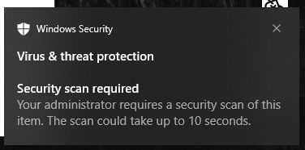
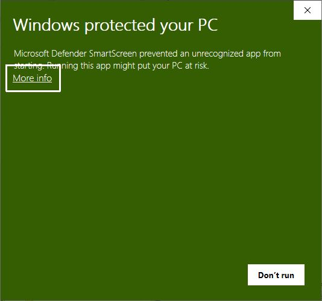
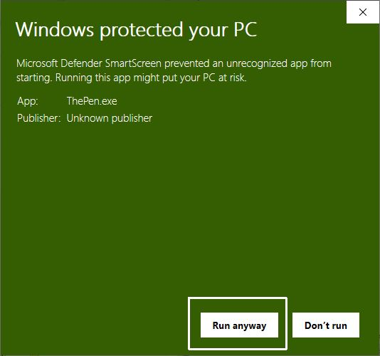

# ThePen
ThePen is a software for drawing on screen in Windows. It started just for my online lectures. I don't have any specific plan to push this work. But I really hope it used widely and be helpful for you.

## Download the Latest Version
 * Alpha10 : https://github.com/ladofa/thepen/releases/download/%23thepenalpha/ThePen-alpha11.zip
 * It is not allowed by Windows SmartScreen. It is **not officially authorized** for Windows yet. You have to check the advanced option.
  - Virus warning can be shown
    

  - For installation, you need to select advanced option

## Important Features
 * One Key Sourtcut : Push only one keyboard button to change your pen type and color.
   
 
 * Easy Switch : Just by lifting the stylus pen, it switches to drawing mode. And just move your mouse to escape drawing mode.
   - It doesn't work on some applications(Chrome, Edge, VSCode, etc.). In this case, move your pen to edges of the monitor to switch mode.
     
   
 * Shaking gesture to clear all drawing.
 * Shapes : Line, Circle, Rectangle, Grid (One Key Shortcut Only)
 * Stamp : Just push a key to put your stamps. (One Key Shortcut Only)
 * Arrow : Add arrow on free drawings or any shapes.
 * Overlay - Display current time, text messages and images. (It is not in maintenance yet)
 * Right click and move to erase.
 * Color palette swap (shortcut : number key 7(&) )
 * Multi Board (shortcut : F1, F2, F3)

## Reference
 * Epic Pen : https://epic-pen.com/
 * Panser Pen : https://kinfolksoft.com/%EB%B8%8C%EB%A6%AC%ED%95%91%ED%8E%9Cbriefing-pen-2/
 * And others : I refered them in source codes.

## Development Environment
 * WPF C# on .NET 6.0
 * PixiEditor.colorPicker (3.1.0) - MIT License

## Release Notes
 * 2024-03-23 (Alpha 11)
   - Fix Eraser Bug (from Alpah10)
   - Fix Arrow Bug (arrow tip will not split with body)
   - Fix Background Bug (back1.png, back2.png will be possible)
   - New gesture (in eraser mode, touch left screen edge and right -> clear all)
 * 2024-03-15 (Alpha 10)
   - add Multi board, each board has own pen style, (shortcut F1, F2, F3) (pen swap will be deprecated.)
   - add temporary hide drawing (shortcut F1, F2, F3 - press again)
   - add palette swap, in setting you can choose twin color.
   - Right click works as eraser.
   - Quick quit - clear all and quit drawing at once (shortcut q)
 * 2024-03-02 (Alpha 8)
   - The taskbar is always visible when you press alt+tab between fullscreen applications.
 * 2024-01-18 (Alpha 7)
   - The eraser got bigger, you can change the size.
   - Draw arrow on the tip of your line with the shotcut (default : Left Shift)
   - Bug Fixed : mouse effects are available from now.
   - Changed to .Net 6.0
 * 2023-03-14 (Alpha 6)
   - Fix the dpi problem
   - Changed to .Net 7.0 (VS 2022)

## Future Works
 * More settings for the mouse effect.
 * Offering Background To Draw
 * Temporary hide
