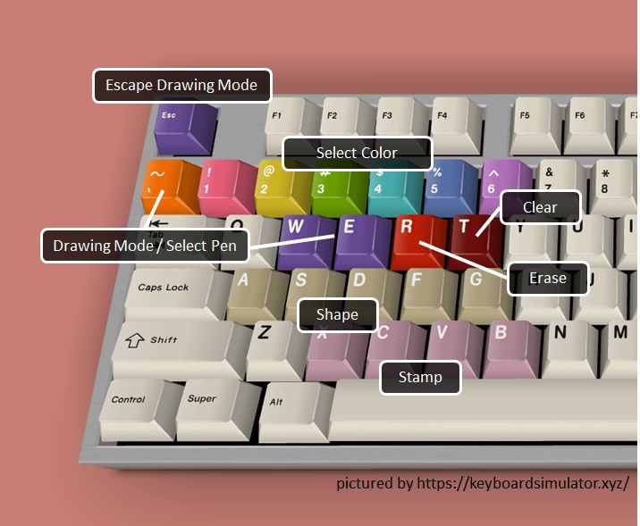

# ThePen
ThePen is a software for drawing on screen in Windows. It started just for my online lectures. I don't have any specific plan to push this work. But I really hope it used widely and be helpful for you.

## Download the Latest Version
Alpha5 : https://github.com/ladofa/thepen/releases/download/%23thepenalpha/thepen-alpha5.zip

## Important Features
 * One Key Sourtcut : Push only one keyboard button to change your pen type and color.
 
 * Easy Switch : Just by lifting the stylus pen, it switches to drawing mode. And just move your mouse to escape drawing mode.
   - It doesn't work on some applications(Chrome, Edge, VSCode, etc.). In this case, move your pen to edges of the monitor to switch mode.
   
 * Shaking gesture to clear all drawing.
 * Shapes : Line, Circle, Rectangle, Grid (One Key Shortcut Only)
 * Stamp : Just push a key to put your stamps. (One Key Shortcut Only)
 * Overlay - Display current time, text messages and images.

## Reference
 * Epic Pen : https://epic-pen.com/
 * Panser Pen : https://kinfolksoft.com/%EB%B8%8C%EB%A6%AC%ED%95%91%ED%8E%9Cbriefing-pen-2/
 * And others : I refered them in source codes.

## Development Environment
 * WPF C# on .NET 5.0
 * PixiEditor.colorPicker (3.1.0) - MIT License

## Future Works
 * More settings for the mouse effect.
 * Offering Background To Draw
 * Temporary hide

